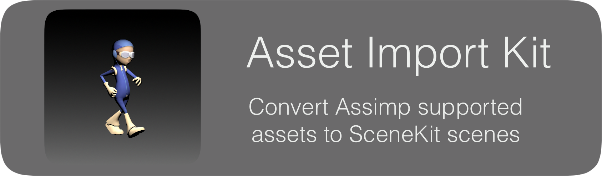

=========

**AssetImportKit** is a cross platform library (macOS, iOS) that coverts the files supported by [Assimp](https://github.com/assimp/assimp) to [Scene Kit](https://developer.apple.com/reference/scenekit) scenes. This library was written as more stable pure Swift version of [AssimpKit](https://github.com/dmsurti/AssimpKit) which makes is easy to use in Swift projects.

Features
---

AssetImportKit allows you to import ***29 file formats*** directly in SceneKit at runtime.
The library supports:
* Geometry
* Materials (with color, embedded textures and external textures)
* Cameras and
* Skeletal animations.

#### Supported file formats ####

AssetImportKit supports the following file formats:
3D, 3DS, 3MF, AC, AC3D, ACC, AMJ, ASE, ASK, B3D, BLEND (Blender), BVH, COB, CMS, DAE/Collada, DXF, ENFF, FBX, glTF 1.0 + GLB, glTF 2.0, HMB, IFC-STEP, IRR / IRRMESH, LWO, LWS, LXO, MD2, MD3, MD5, MDC, MDL, MESH / MESH.XML, MOT, MS3D, NDO, NFF, OBJ, OFF, OGEX, PLY, PMX, PRJ, Q3O, Q3S, RAW, SCN, SIB, SMD, STL, STP, TER, UC, VTA, X, X3D, XGL, ZGL.

Requirements
---

- Xcode 9.0 or later
- Swift 4
- iOS 11.0 or later
- macOS 10.12 or later

Usage
---

To use the library in your projects just build the iOS of macOS version of the framework and grab it from the target folder of the AssetImportKit project.

Carthage support will be added in future.

Note for `iOS` builds: if you are developing an `iOS` application, set the `Enable Bitcode` under `Build Settings->Build Options` of your target to `NO`.

License
---

[AssetImportKit's license](LICENSE.md) is based on the modified, 3-clause BSD-License.
